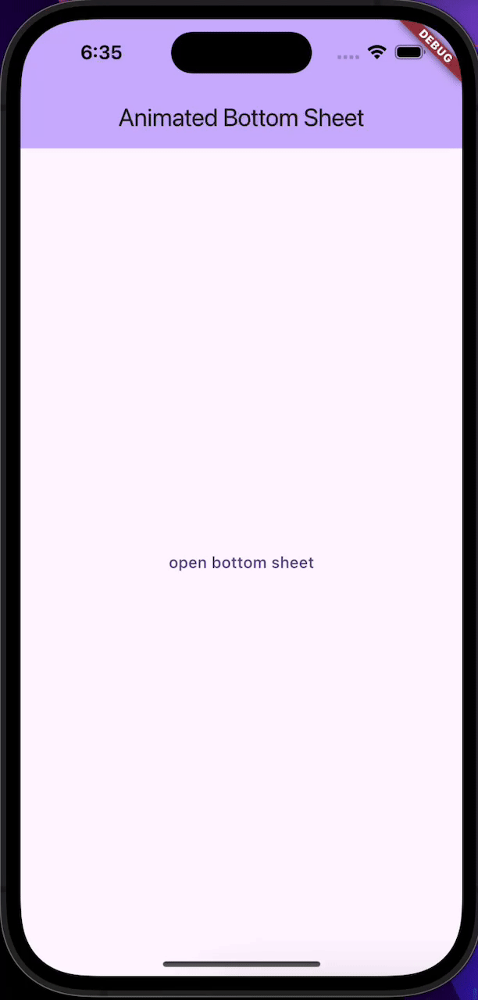

# Animated_bottom_sheet

A customizable and animated bottom sheet for Flutter, 
providing flexible options such as custom height, background color, 
drag handle, safe area support, and smooth animation curves. 
Perfect for creating modern and interactive modal sheets 
with minimal boilerplate code.


## Badges


[](https://choosealicense.com/licenses/mit/)


## Installation

Add the following to your `pubspec.yaml`:

```yaml
dependencies:
  animated_bottom_sheet: ^1.0.0
```

then 

```
flutter pub get
``` 
## Usage/Examples

```dart
AnimatedBottomSheet.open(
      context: context,
      showDragHandle: true,
      useRootNavigator: true,

      bottomSheetContentBuilder: (StateSetter setModalState) {
        return Container(
          color: Colors.white,
          child: SingleChildScrollView(
            child: Column(
              mainAxisSize: MainAxisSize.min,
              children: [
                TextButton(
                  onPressed: () {
                    _items.add('new test item');
                    setModalState(() {});
                  },
                  child: Text("add item"),
                ),
                TextButton(
                  onPressed: () {
                    _items.removeLast();
                    setModalState(() {});
                  },
                  child: Text("remove item"),
                ),
                Column(
                  children: List.generate(_items.length, (index) {
                    return Container(
                      height: 100,
                      width: MediaQuery.of(context).size.width * 0.9,
                      alignment: Alignment.center,
                      decoration: BoxDecoration(
                        color: Colors.indigo,
                        borderRadius: BorderRadius.all(Radius.circular(15)),
                      ),
                      margin: EdgeInsets.symmetric(vertical: 20),
                      child: Text(
                        _items[index],
                        style: TextStyle(
                          color: Colors.white,
                          fontWeight: FontWeight.w700,
                        ),
                      ),
                    );
                  }),
                ),
              ],
            ),
          ),
        );
      },
    );
```


| Parameter                   | Type                           | Default                                           | Description                                         |
| --------------------------- | ------------------------------ | ------------------------------------------------- | --------------------------------------------------- |
| `context`                   | `BuildContext`                 | *required*                                        | The BuildContext used to show the sheet             |
| `bottomSheetContentBuilder` | `Widget Function(StateSetter)` | *required*                                        | Builder function to create the bottom sheet content |
| `height`                    | `double?`                      | `null`                                            | Height as a fraction of screen height               |
| `alignment`                 | `Alignment?`                   | `null`                                            | Sheet alignment                                     |
| `backgroundColor`           | `Color?`                       | `Colors.white`                                    | Sheet background color                              |
| `showDragHandle`            | `bool`                         | `false`                                           | Whether to show a drag handle                       |
| `curve`                     | `Curve`                        | `Curves.elasticOut`                               | Animation curve                                     |
| `isDismissable`             | `bool`                         | `true`                                            | Allow closing the sheet by tapping outside          |
| `useSafeArea`               | `bool`                         | `true`                                            | Wrap content in SafeArea                            |
| `barrierLabel`              | `String?`                      | `null`                                            | Barrier label                                       |
| `barrierColor`              | `Color?`                       | `null`                                            | Barrier background color                            |
| `routeSettings`             | `RouteSettings?`               | `null`                                            | Custom route settings                               |
| `borderRadius`              | `BorderRadiusGeometry`         | `BorderRadius.vertical(top: Radius.circular(15))` | Border radius of the sheet                          |
| `duration`                  | `Duration`                     | `700ms`                                           | Animation duration                                  |


## Screenshots




## Features

- 🎯 Easy to use with a single static method
- ⚡ Smooth and customizable animations
- 🖼️ Support for custom height and alignment
- 🎨 Custom background color and rounded corners
- 🛡️ Safe area support
- 🏷️ Barrier customization (color, label, dismissable, etc.)
- ✨ Optional drag handle for a modern look

## 🤝 Contributing

Contributions, issues, and feature requests are welcome!  

To contribute:  
1. Fork the repository  
2. Create a new branch (`git checkout -b feature-name`)  
3. Make your changes and commit (`git commit -m 'Add some feature'`)  
4. Push to the branch (`git push origin feature-name`)  
5. Open a Pull Request  

Please make sure your code follows the project's coding style and passes all tests.
## License

This project is licensed under the MIT License - see the [LICENSE](LICENSE) file for details.
